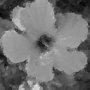

# Brut voronoi image approximation

This example shows an image approximation using brut voronoi.

## Execution

Those commands are executed from the project root.
This script should be used with small images since
the brut voronoi approach is really expensive.

```shell script
# Create the dist folder
make

./dist/BrutVoronoiApproximation -i ../image-example/example-0.png -g 3000 -p
```

## Input and output 


====>

